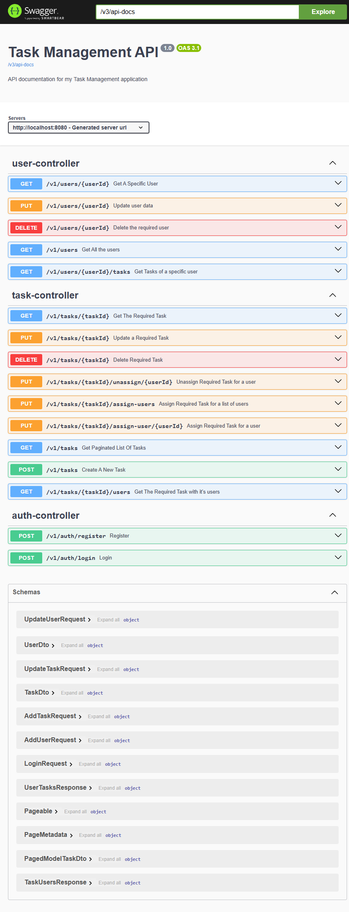

# 🛡 Task Management Backend

Spring Boot REST API supporting a full-featured Task Management system, designed to integrate seamlessly with React as a frontend.

## 🚀 Features

- **User Authentication** via JWT `(USER | ADMIN)`
- **CRUD Task API**: create, update, delete, fetch tasks
- **Pagination** support (page & size)
- **Role-based access control**
- **OpenAPI integration**
- **User management**
- **Task management**
- **Auth management**
- **Auditing fields**: createdTime, lastModifiedTime
- **Input validation** using `@Valid`, `@NotNull`
- **Global exception handling** via `@ControllerAdvice`

## 📦 Tech Stack

- Java 21, Spring Boot 3.x
- Spring Security (JWT)
- Spring Data JPA – Hibernate + MySql
- MapStruct for DTO mapping
- Maven for build

## 📂 Project Structure

```
src/
├── main/
│   ├── java/com/ziad/taskmanagement/
│   │   ├── config/              # security, JWT filters
│   │   ├── controller/          # REST endpoints
│   │   ├── dto/                 # Request/Response DTOs
│   │   ├── entity/              # JPA entities
│   │   ├── repository/          # Spring Data repositories
│   │   ├── service/             # Business logic
│   │   └── exception/           # Custom exceptions & handlers
│   └── resources/
│       └── application.properties      # configuration
└── test/                        # Unit & integration tests
```

## 🔧 Setup & Run

1. **Clone the repo:**
   ```bash
   git clone https://github.com/ziadabdelnaby10/task-management.git
   cd task-backend
   ```

2. **Configure `src/main/resources/application.properties`**:
   ```yaml
   spring:
     datasource:
       url: jdbc:mysql://localhost:3306/task-management?createDatabaseIfNotExist=true
       username: root
       password: password
     jpa:
       hibernate:
         ddl-auto: update
       show-sql: true
   jwt:
     secret: JWT-secret
     expirationMs: 3600000
   ```

3. **Build & run:**
   ```bash
   mvn clean install
   mvn spring-boot:run
   ```

   The API will be accessible at: `http://localhost:8080`

## 📋 API Endpoints

### 🔐 Auth
| Endpoint         | Method | Body                                 | Description             |
|------------------|--------|---------------------------------------|-------------------------|
| `/auth/register` | POST   | `{ firstName, lastName, email, password, phone, role }` | Register new user |
| `/auth/login`    | POST   | `{ email, password }`                | Authenticate, return JWT |

### 👤 Users
| Endpoint      | Method | Description                    |
|---------------|--------|--------------------------------|
| `/users`      | GET    | List all users                 |

### ✅ Tasks
| Endpoint             | Method | Query Params / Body                                         | Description                     |
|----------------------|--------|-------------------------------------------------------------|---------------------------------|
| `/tasks`             | GET    | `?page=&size=&status=&priority=&search=`                    | List tasks (paginated + filter) |
| `/tasks/{id}`        | GET    | -                                                           | Task details by ID              |
| `/tasks`             | POST   | `{ title, description, priority, taskStats, deadline, createdByUserId }` | Create task |
| `/tasks/{id}`        | PUT    | Updated task body                                           | Update existing task            |
| `/tasks/{id}`        | DELETE | -                                                           | Delete task                     |



## 🧠 Usage Notes

- `createdByUserId` must refer to a valid user UUID.
- Supports filtering, pagination, and search in the `GET /tasks` endpoint.
- JWT must be included in `Authorization: Bearer <token>`.
- Use the `role` field (`USER`/`ADMIN`) for role-based access control.

## 📄 Example: Create Task via `curl`

```bash
curl -X POST http://localhost:8080/api/tasks \
  -H "Content-Type: application/json" \
  -H "Authorization: Bearer $TOKEN" \
  -d '{
    "title": "New Task",
    "description": "Details",
    "priority": "high",
    "taskStats": "todo",
    "deadline": "2025-07-10",
    "createdByUserId": "ebdc0ae5-3f44-4af6-a584-4397191c858b"
  }'
```