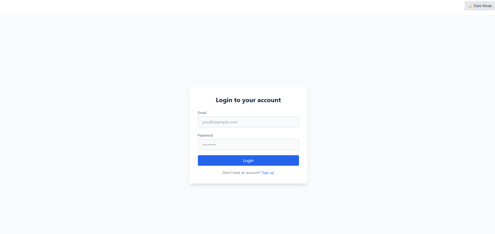
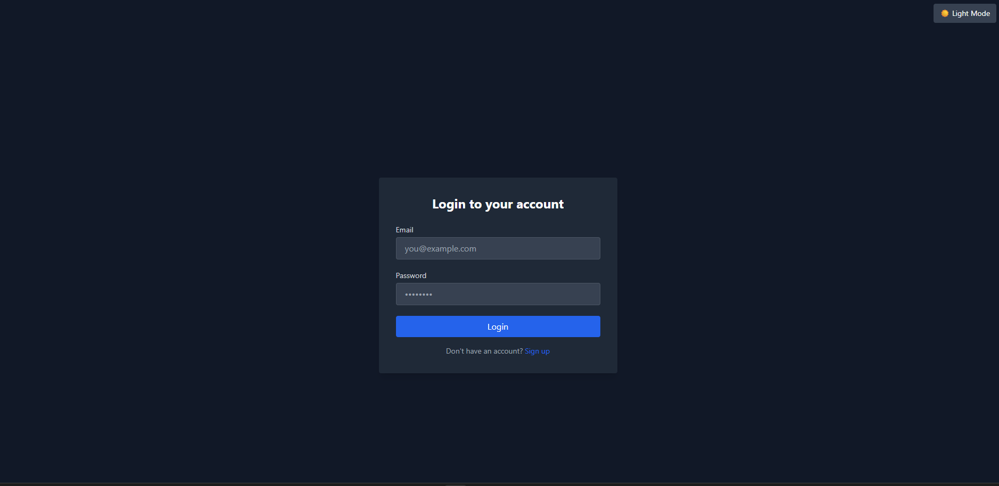

# 📝 Task Manager Web App

A modern, responsive task management web application built with **React**, **Tailwind CSS**, **Redux Toolkit**, and **Spring Boot** (backend). It supports authentication, task creation, editing, filtering, pagination, and dark mode.

---

## Screenshots




## 🚀 Features

- ✅ User authentication (Login / Signup with JWT)
- ✅ Create, edit, delete tasks
- ✅ Assign tasks to users
- ✅ Filter by status, priority, and search
- ✅ Pagination (backend-powered)
- ✅ Dark mode toggle (persistent)
- ✅ Responsive layout (mobile-first)
- ✅ Secure API access using JWT
- ✅ Role-based logic support (ADMIN / USER)

---

## 🛠️ Tech Stack

| Frontend     | Backend       | State Management | UI/UX        |
|--------------|---------------|------------------|--------------|
| React        | Spring Boot   | Redux Toolkit    | Tailwind CSS |
| React Router | JWT Auth      | Async Thunks     | Dark Mode    |
| Axios        | REST API      | Redux Slices     | Toast Alerts |

---

## 📂 Folder Structure

```
src/
├── components/           # Reusable UI components
├── pages/                # Page-level components (Dashboard, TaskForm, etc.)
├── store/                # Redux slices and store config
├── utils/                # Axios instance, helpers
├── App.jsx               # Routes
├── main.jsx              # App entry
└── index.css             # Tailwind styles
```

---

## ⚙️ Setup & Installation

```bash
# Clone the repository
git clone https://github.com/ziadabdelnaby10/task-management.git
cd task-front

# Install dependencies
npm install

# Start dev server
npm run dev
```

### ✅ Backend Setup

> Make sure your Spring Boot API is running on `http://localhost:8080/`

---

## 🔐 Authentication

- Login and signup return a JWT token
- Token is stored in `localStorage`
- Axios adds token to all requests via `Authorization: Bearer <token>`
- Token is decoded on login to fetch user info

---

## 🧾 API Integration

- **GET** `/tasks?page=1&status=todo`
- **POST** `/tasks`
```json
{
  "title": "Task A",
  "description": "Details",
  "priority": "high",
  "taskStats": "todo",
  "deadline": "2025-07-10",
  "createdByUserId": "uuid"
}
```

- **GET** `/users` → used to assign task creator
- **POST** `/auth/signup`, `/auth/login` → with `email`, `password`, `role`

---

## 🌙 Dark Mode

- Enabled via Tailwind `darkMode: 'class'`
- State is stored in `localStorage`
- Toggled using a button in the top-right of each page

---


## 📄 License

MIT License © 2025